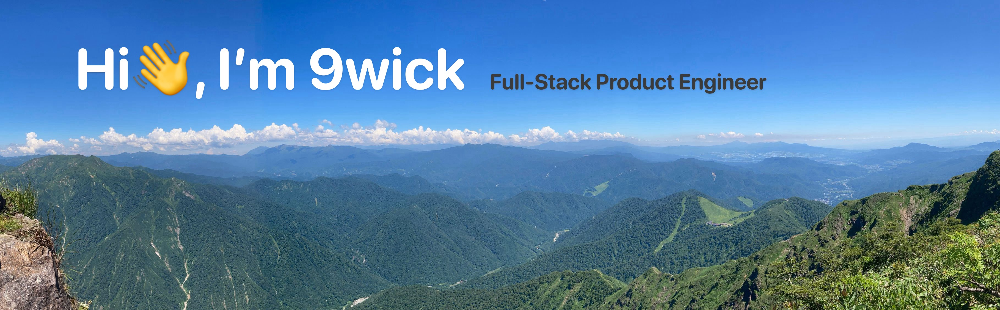

## 🏋️‍♀️ About 9wick.

- 🧑🏻‍💻 Full Stack Engineer
- 🏠 Living in Tokyo, Japan
- ⛰️ Love to mountain and trail running

<!--
**9wick/9wick** is a ✨ _special_ ✨ repository because its `README.md` (this file) appears on your GitHub profile.

Here are some ideas to get you started:

- 🔭 I’m currently working on ...
- 🌱 I’m currently learning ...
- 👯 I’m looking to collaborate on ...
- 🤔 I’m looking for help with ...
- 💬 Ask me about ...
- 📫 How to reach me: ...
- 😄 Pronouns: ...
- ⚡ Fun fact: ...
-->

## 💬 Where to find me

## 🌴 Skill
Language / Framework

Storage

Infra / OS

## 📈 Status

 

<!--START_SECTION:lapras-card-->

  
Last Updated on 7/24/2024, 3:09:26 PM

<!--END_SECTION:lapras-card-->

